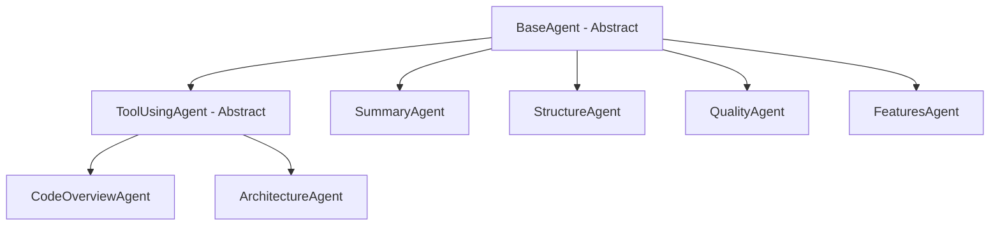

# GitArch - Agent Documentation

GitArch uses 6 specialized AI agents orchestrated in a 3-phase pipeline. Each agent has a specific role, receives targeted context, and produces structured markdown output.

## Agent Hierarchy



**BaseAgent**: Simple generation - sends system prompt + user prompt to Gemini, gets text back.

**ToolUsingAgent**: Extends BaseAgent with tool-calling capability. The agent can call `read_file`, `search_code`, and `list_directory` during generation to explore the codebase dynamically.

---

## Phase 1 - Foundation (Parallel)

These three agents run simultaneously. They only need the raw context (file tree, README, file contents).

### SummaryAgent

| Property | Value |
|----------|-------|
| **File** | `agents/summary.py` |
| **Base** | `BaseAgent` |
| **Input** | README + file tree |
| **Output** | `{"summary": "..."}` |
| **Purpose** | 3-5 sentence project summary - what it does, what problem it solves, who it's for |

### StructureAgent

| Property | Value |
|----------|-------|
| **File** | `agents/structure.py` |
| **Base** | `BaseAgent` |
| **Input** | File tree |
| **Output** | `{"structure": "...", "file_tree": "..."}` |
| **Purpose** | 2-3 sentence high-level overview of main folders/modules |

### CodeOverviewAgent

| Property | Value |
|----------|-------|
| **File** | `agents/code_overview.py` |
| **Base** | `ToolUsingAgent` |
| **Input** | File tree + first 30 file contents (up to 2000 chars each) |
| **Output** | `{"code_overview": "..."}` |
| **Purpose** | Explain what each script/module does. Uses tools to read important files not included in the initial batch. Groups related files by directory. |

---

## Phase 2 - Architecture (Sequential)

Runs after Phase 1 completes. Uses Phase 1 outputs as additional context.

### ArchitectureAgent

| Property | Value |
|----------|-------|
| **File** | `agents/architecture.py` |
| **Base** | `ToolUsingAgent` |
| **Input** | Summary + Code Overview + Structure + file tree |
| **Output** | `{"architecture": "..."}` |
| **Purpose** | Generate Mermaid.js architecture diagrams |

**Output structure:**
1. **Components** - 2-3 sentences listing main components
2. **High-Level Architecture** - Main flowchart (max 8 nodes)
3. **Detail Diagrams** - Separate diagram for each pattern found:
   - Data preprocessing / ETL pipeline
   - ML training / inference pipeline
   - RAG pipeline
   - API request/response lifecycle
   - Authentication / authorization flow
   - Background job / task queue flow

**Mermaid syntax rules enforced:**
- Alphanumeric node IDs only
- No special characters in labels `( ) " ' < > & #`
- Arrow labels between pipes, kept short
- Every `subgraph` must have matching `end`
- One relationship per line
- No comments (`%%`) or HTML inside mermaid blocks

---

## Phase 3 - Review (Parallel)

Runs after Phase 2 completes. Uses Phase 1 + Phase 2 outputs.

### QualityAgent

| Property | Value |
|----------|-------|
| **File** | `agents/quality.py` |
| **Base** | `BaseAgent` |
| **Input** | Architecture overview (first 2000 chars) + first 10 file contents |
| **Output** | `{"quality": "..."}` |
| **Purpose** | Code quality review |

**Output structure:**
1. **Issues Found** - Each with file path and explanation
2. **Improvement Suggestions** - Ranked by impact
3. **Overall Quality Score** - 1-10 with justification

**Special rule:** Does not flag model names, API identifiers, or library names based on training data cutoff. Only flags issues visible in code logic.

### FeaturesAgent

| Property | Value |
|----------|-------|
| **File** | `agents/features.py` |
| **Base** | `BaseAgent` |
| **Input** | Summary + Architecture + Quality review |
| **Output** | `{"features": "..."}` |
| **Purpose** | Suggest realistic next features and improvements |

**Output structure:**
1. **Quick Wins** - Easy to implement
2. **Medium Effort** - Moderate complexity
3. **Larger Initiatives** - Significant work

Max 10 suggestions, each with what + why.

---

## Orchestration Timeline

```
Time ──────────────────────────────────────────────────────►

Phase 1 (20-55%):
  ┌──────────────┐
  │ SummaryAgent  │──┐
  └──────────────┘  │
  ┌──────────────┐  │
  │StructureAgent│──┤
  └──────────────┘  │
  ┌────────────────┐│
  │CodeOverviewAgent├┤
  └────────────────┘│
                    ▼
Phase 2 (55-75%):
  ┌──────────────────┐
  │ArchitectureAgent │──┐
  └──────────────────┘  │
                        ▼
Phase 3 (75-95%):
  ┌──────────────┐
  │ QualityAgent │──┐
  └──────────────┘  │
  ┌──────────────┐  │
  │ FeaturesAgent│──┤
  └──────────────┘  │
                    ▼
                 Report
```

## Progress Tracking

| Progress | Phase |
|----------|-------|
| 5% | Downloading repository |
| 15% | Building context |
| 20% | Phase 1 start |
| 55% | Phase 2 start |
| 75% | Phase 3 start |
| 95% | Compiling report |
| 100% | Done |
