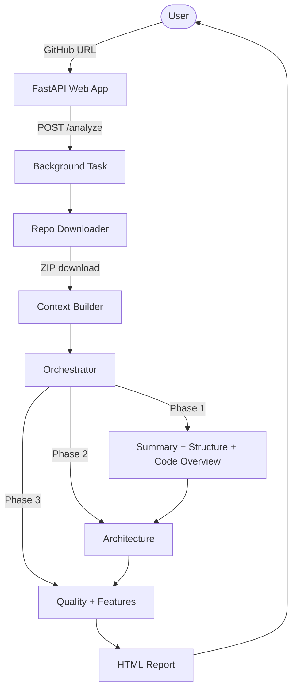

# GitArch - System Overview

GitArch is a multi-agent AI system that analyzes any public GitHub repository and generates a comprehensive architecture report. It downloads the repo, builds context from the codebase, runs 6 specialized AI agents in a phased pipeline, and renders the results as an interactive web report.

## High-Level Architecture



## Request Lifecycle


## Core Components

| File | Role |
|------|------|
| `main.py` | FastAPI app - routes, job management, background task |
| `repo_manager.py` | Download GitHub repo as ZIP, extract with filtering |
| `context_builder.py` | Build file tree, read files with priority sorting |
| `tools.py` | Tool declarations and executor for agents (read_file, search_code, list_directory) |
| `gemini_client.py` | Gemini API wrapper - simple generation and tool-calling loop |
| `agents/orchestrator.py` | Phased pipeline orchestrator - runs 6 agents in 3 phases |
| `agents/base.py` | BaseAgent and ToolUsingAgent abstract classes |

## Data Flow

### 1. Repository Download (`repo_manager.py`)

```
GitHub URL
  → parse owner/name
  → GitHub API → get default branch
  → Download ZIP archive
  → Extract to temp dir (skip node_modules, .git, binaries, etc.)
  → Return local path
```

### 2. Context Building (`context_builder.py`)

```
Local repo path
  → Generate file tree (visual tree with ├── └── format)
  → Read README (md/rst/txt)
  → Collect files with priority sorting:
      Priority 0: README
      Priority 1: main.py, app.py, index.ts, etc.
      Priority 2: Dockerfile, docker-compose, pyproject.toml, etc.
      Priority 3: routes, api, models, schema, config files
      Priority 4: .py, .ts, .js, .go, .rs, .java files
      Priority 5: everything else
  → Read files up to 300K total chars, 15K per file
  → Return {tree, readme, files, repo_path}
```

### 3. Agent Pipeline (`agents/orchestrator.py`)

```
Phase 1 (parallel):  Summary + Structure + Code Overview
Phase 2 (sequential): Architecture (uses Phase 1 results)
Phase 3 (parallel):  Quality + Features (uses Phase 2 results)
```

### 4. Report Rendering (`templates/report.html`)

```
Raw markdown from agents
  → marked.js parses markdown
  → highlight.js highlights code blocks
  → Mermaid.js renders diagrams (with sanitization and retry)
  → 6 tabs: Summary, Code, Structure, Architecture, Quality, Features
```

## Tool System

Agents with tool access (`ToolUsingAgent`) can call these tools during generation:

| Tool | Description |
|------|-------------|
| `read_file(file_path)` | Read a specific file from the downloaded repo |
| `search_code(pattern)` | Regex search across all files, returns matching lines (max 50) |
| `list_directory(dir_path)` | List contents of a directory |

The tool-calling loop (`gemini_client.py`) runs up to 10 steps. Each step: model generates → if function_call found → execute tool → feed result back. When model stops calling tools, the accumulated text is returned.
